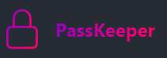

# PassKeeper - Password Manager



## Overview

PassKeeper is a secure and user-friendly password manager that helps you store and manage your passwords in one place. With features like secure password storage, password generation, and easy access to your credentials, PassKeeper ensures your online security and convenience.

## Features

- **Secure Password Storage**: Safely store all your passwords in an encrypted format.
- **Password Generation**: Generate strong, random passwords for enhanced security.
- **Search Functionality**: Quickly find your passwords using the search bar.
- **Edit and Delete**: Easily edit or delete stored passwords.
- **Two-Factor Authentication**: Add an extra layer of security to your account.
- **Cross-Platform Support**: Access your passwords on multiple devices.
- **User-Friendly Interface**: Intuitive design for a seamless user experience.

## Technologies Used

- **Frontend**: React, Vite, Tailwind CSS
- **Backend**: *To be updated in the future*
- **Database**: *To be updated in the future*
- **Authentication**: *To be updated in the future*

## Installation

To get started with PassKeeper, follow these steps:

1. **Clone the repository**:
   ```
   git clone https://github.com/http-bala/your-repo-name.git
   ```
   ```
   cd your-repo-name
    ```
    ```
    npm install
    ```
    ```
    npm run dev
    ```
## Usage
- **Adding a Password**: Click on the "Add" button and fill in the required details.
- **Viewing Passwords**: Click on the password entry to view details.
- **Searching for Passwords**: Use the search bar to filter passwords by site name.
- **Editing and Deleting**: Select an entry to edit or delete passwords.

## License
This project is licensed under the MIT License. See the LICENSE file for more details.


### Notes:
- Make sure to replace placeholders (like the logo URL and repository link) with your actual information.
- Adjust the features and technologies section based on what your application actually uses.
- You can also add a section for any additional tools, libraries, or resources you used during development.
  
Feel free to modify it further to match your application's branding and style! If you need anything else, let me know!
